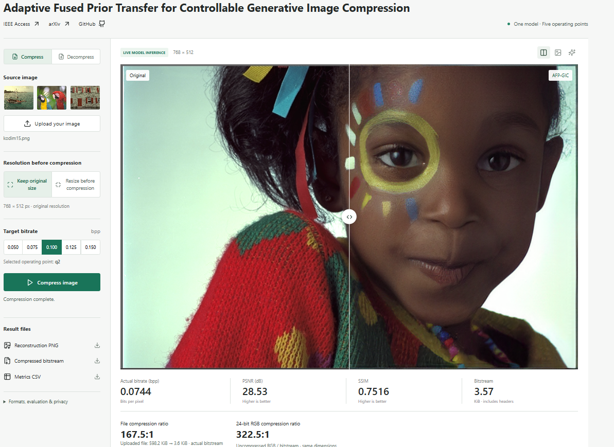
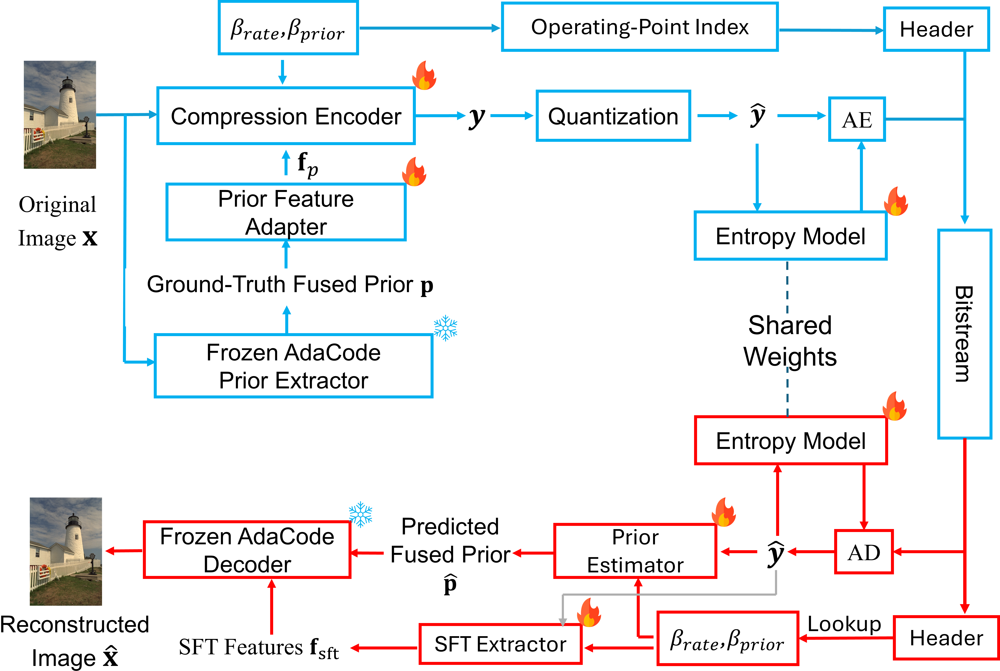
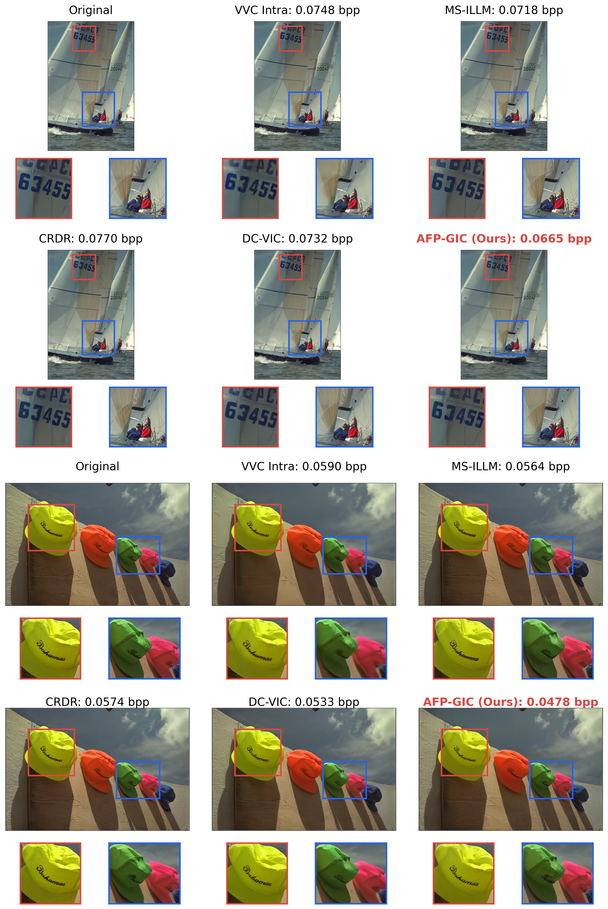

# 🚀 AFP-GIC: Controllable Generative Image Compression

✨  **AFP-GIC pretrained weights are now available on [Hugging Face](https://huggingface.co/yifeipet/AFP-GIC).** Download the model and use our inference code to compress and decompress your own images. [See the code example below.](#hugging-face-model-compress-your-own-images)

<p align="center">
  <a href="https://ieeexplore.ieee.org/document/11712133"></a>
  <a href="https://arxiv.org/abs/2605.16817"></a>
  <a href="https://huggingface.co/spaces/yifeipet/AFP-GIC"></a>
  <a href="https://drive.google.com/drive/folders/1qqPyKHtdiIVoiYWl3mZNGnJFXGzhRHTR?usp=drive_link"></a>
  <a href="https://doi.org/10.24433/CO.1853201.v1"></a>
</p>

**AFP-GIC** is designed to make generative image compression **content-adaptive** and **reduce hallucinations: invented details that do not match the original image**. It adapts the visual knowledge transferred from a pretrained model to each image, guiding compression and reconstruction toward **more realistic textures and better preservation of the original content**, even at very low bitrates.

Our paper, [*Adaptive Fused Prior Transfer for Controllable Generative Image Compression*](https://ieeexplore.ieee.org/document/11712133), published in **IEEE Access (2026)**, presents this content-adaptive design with **five bitrate operating points in a single deployable pretrained model**, without transmitting the fused prior or reloading model weights between operating points. System-level benchmarks on an NVIDIA RTX 4090 demonstrate **18.1% lower decoder latency** and **31.1M fewer inference parameters** than DC-VIC. Explore the released code and checkpoint, or upload your own images to experience compression and reconstruction in the live demo below.

## [🤗 Live Interactive Demo on Hugging Face](https://huggingface.co/spaces/yifeipet/AFP-GIC)

[](https://huggingface.co/spaces/yifeipet/AFP-GIC)

<p>Try it with your own images: choose an operating point, compress, and compare the reconstruction side by side. Download the actual compressed bitstream and decode it in the demo. <strong>The demo runs on CPU by default.</strong></p>

<p align="center"><a href="https://huggingface.co/spaces/yifeipet/AFP-GIC"><strong>Try the live demo →</strong></a></p>

## ✨ Highlights

- **Multi-rate compression without a collection of models:** one checkpoint covers all five reported operating points, simplifying model management.
- **Adaptive prior guidance without prior transmission:** transfer image-adaptive knowledge from frozen AdaCode to guide encoding and predict the fused prior at the decoder.
- **18.1% lower decoder latency:** 80.47 ms versus 98.27 ms for DC-VIC.
- **20.5% fewer inference parameters:** 120.6M versus 151.7M, a reduction of **31.1M parameters**.
- **From paper to hands-on evaluation:** custom image uploads, downloadable bitstreams, standalone decompression, and per-image benchmark CSVs make the results accessible beyond the paper.

## ⚡ Efficiency

| Method | Inference parameters | Encoder latency | Decoder latency |
| :--- | ---: | ---: | ---: |
| DC-VIC | 151.7M | 61.61 ms | 98.27 ms |
| **AFP-GIC** | **120.6M** | 81.34 ms | **80.47 ms** |

Benchmark: NVIDIA RTX 4090, 100 DIV2K patches of 256 x 256 pixels (paper, Table 5). Parameter counts include frozen components. These system-level measurements are separate from the CPU-hosted demo's response time.

## 🧩 Architecture

Continuing our research on learned image compression, AFP-GIC combines adaptive fused-prior transfer and single-model bitrate control in an asymmetric architecture. A frozen AdaCode model supplies image-adaptive guidance to the encoder; the decoder predicts the fused prior from the compressed representation instead of receiving it as side information.

<p align="center">
  
</p>

**Figure 1.** Overview of AFP-GIC. Blue and red indicate encoding and decoding, respectively; snowflakes and flames denote frozen and trainable modules.

## 🖼️ Visual Comparisons

<p align="center">
  
</p>

**Figure 5.** Low-bitrate visual comparisons on Kodak. Baselines are shown at their closest available released bitrates; each image is labeled with its actual bpp. Images and annotations are reproduced from the paper.

<a name="paper-metrics"></a>

## 📊 Paper Metrics

The [metrics directory](metrics/) provides CSV results for all five AFP-GIC operating points on Kodak, CLIC2020, and DIV2K: [dataset summaries](metrics/afp_gic_operating_points.csv), [paper-rounded values](metrics/afp_gic_paper_values.csv), and 2,760 per-image records including PSNR, SSIM, MS-SSIM, SNR, LPIPS, DISTS, and NIQE. See the [data description](metrics/README.md) for the evaluation records and aggregation checks. FID is provided as a dataset-level metric.

## 📥 Reconstructed Images and Metrics

To make research comparisons easier, we provide **all 2,760 reconstructed images, per-image metrics, and dataset-average metrics** in our [GitHub Releases](https://github.com/yifeipet/AFP_GIC/releases), covering 24 Kodak, 428 CLIC2020, and 100 DIV2K images at five bitrate operating points. Download the datasets and operating points you need to include AFP-GIC as a baseline under matched evaluation protocols, **without rerunning the pretrained model**.

## <a href="https://doi.org/10.24433/CO.1853201.v1"></a> Reproducible Capsule

Run the Kodak evaluation on [Code Ocean](https://doi.org/10.24433/CO.1853201.v1) with the pretrained model, input images, and configured environment. The published capsule evaluates all 24 Kodak images at five operating points and provides reconstructed images, metrics, and comparisons with the paper's reference values.

## 🛠️ Installation

This repository provides the **Core Inference and Deployment Release**, including pretrained model inference, evaluation tools, and an interactive demo. Training infrastructure is maintained separately.

The release was tested with **Python 3.9**, **PyTorch 2.1.0**, and **torchvision 0.16.0**. Create a separate environment and install the pinned dependencies:

```bash
git clone https://github.com/yifeipet/AFP_GIC.git
cd AFP_GIC
conda create -n afp-gic python=3.9 -y
conda activate afp-gic
python -m pip install -r public_release/requirements.txt
```

For GPU evaluation, use a PyTorch build compatible with your GPU and driver. Follow the [official PyTorch installation instructions](https://pytorch.org/get-started/previous-versions/) for the pinned version if a platform-specific build is needed. Do not replace the pinned versions with the latest releases when reproducing the paper.

## 📦 Pretrained Model

Download the released checkpoint from [Google Drive](https://drive.google.com/drive/folders/1qqPyKHtdiIVoiYWl3mZNGnJFXGzhRHTR?usp=drive_link) and place it at:

```text
checkpoint/afp_gic_release/model/afp_gic_release.pth.tar
```

The checkpoint already includes the frozen prior component; no separate AdaCode weight download is required.

<a name="hugging-face-model-compress-your-own-images"></a>

## 🧠 Hugging Face Model: Compress Your Own Images

After completing [Installation](#-installation), run the following from the repository root. The Hugging Face Hub provides the pretrained weights; the AFP-GIC code performs compression and decompression.

```bash
python -m pip install huggingface_hub
```

```python
from pathlib import Path
import struct
import sys

import torch
from huggingface_hub import hf_hub_download

runtime = Path("public_release/runtime").resolve()
sys.path.insert(0, str(runtime))
import eval_public_release as afp

device = "cuda:0" if torch.cuda.is_available() else "cpu"
weights = hf_hub_download(
    repo_id="yifeipet/AFP-GIC",
    filename="afp_gic_release.pth.tar",
)
config = afp.load_infer_config(
    str(runtime / "config/afp_gic_release.yaml"), device
)
model = afp.build_comp_model(config).to(device)
model.load_learned_weight(ckpt_path=weights)
model.codec_setup()
model.eval()

# Encode your image at operating point 0 (choose 0 through 4).
with torch.no_grad():
    image = afp.read_real_tensor("input.png")
    parts = model.compress(image, quality_ind=0)["string_list"]
Path("compressed.afp").write_bytes(
    b"".join(struct.pack("<I", len(part)) + part for part in parts)
)

# Decode the saved file. The original image is not needed here.
data = Path("compressed.afp").read_bytes()
parts, offset = [], 0
for _ in range(3):
    if offset + 4 > len(data):
        raise ValueError("Truncated bitstream")
    size = struct.unpack_from("<I", data, offset)[0]
    offset += 4
    if size == 0 or offset + size > len(data):
        raise ValueError("Invalid payload length")
    parts.append(data[offset:offset + size])
    offset += size
if offset != len(data):
    raise ValueError("Unexpected trailing data")
with torch.no_grad():
    reconstruction, _, _ = model.decompress(parts)
afp.img_utils.imwrite("reconstruction.png", reconstruction)
```

Replace `input.png` with your image path. Outputs are `compressed.afp` and `reconstruction.png`. Encoding and decoding can run separately after the same model setup; decoding needs the bitstream and compatible weights, not the original image. This example reads files you created yourself, not untrusted uploads. Images are reconstructed lossily, and large inputs require more memory.


## 🧪 Evaluation

### 📷 Kodak

Obtain the [Kodak dataset](https://r0k.us/graphics/kodak/) and place its 24 original PNG images directly in `datasets/kodak/`.

From the repository root, evaluate one operating point:

```bash
python public_release/test.py -d cuda:0 --dataset kodak --qualities 0
```

Evaluate all five operating points:

```bash
python public_release/test.py -d cuda:0 --dataset kodak --qualities 0 1 2 3 4
```

| Quality index | 0 | 1 | 2 | 3 | 4 |
| :--- | ---: | ---: | ---: | ---: | ---: |
| Nominal target bpp | 0.050 | 0.075 | 0.100 | 0.125 | 0.150 |

Actual bitrates vary with image content. All five indices use the same checkpoint.

### 🗂️ Other Datasets

The entry point also accepts `clic2020_test` and `div2k_valid_hr`. Place the original PNG images in the corresponding directories:

```text
datasets/
|-- kodak/                              # Kodak PNG images
|-- CLIC/
|   `-- clic_test_images/               # CLIC2020 test PNG images
`-- DIV2K_valid_HR/
    `-- DIV2K_valid_HR/                 # DIV2K validation PNG images
```

```bash
python public_release/test.py -d cuda:0 --dataset clic2020_test --qualities 0 1 2 3 4
python public_release/test.py -d cuda:0 --dataset div2k_valid_hr --qualities 0 1 2 3 4
```

### 📁 Outputs

The runner saves reconstructed images, actual bitrates, per-image metrics, and summary files. To choose an output directory:

```bash
python public_release/test.py -d cuda:0 --dataset kodak --qualities 0 --results-root results/kodak_demo
```

For this command, outputs include:

```text
results/kodak_demo/
|-- summary_all.csv
|-- comparison_pivot.csv
`-- kodak/afp_gic_release/q0/
    |-- <image_name>.png
    |-- _bitrates.csv
    |-- per_image_metrics.csv
    |-- _metrics.json
    `-- summary.json
```

**Metric protocols:** `per_image_metrics.csv` records in-loop PSNR, MS-SSIM, and LPIPS; `_metrics.json` records metrics computed on saved reconstructions. These evaluation paths can produce different values. See the paper and Supplementary Material for the reporting protocols, and [Paper Metrics](#paper-metrics) for the released benchmark CSVs.

Run `python public_release/test.py --help` for the available options. Metric libraries may download their pretrained weights on first use.

## 📝 Citation

If you find our work useful in your research, please cite our official [IEEE Access paper](https://ieeexplore.ieee.org/document/11712133):

```bibtex
@article{pei2026adaptive,
  title   = {Adaptive Fused Prior Transfer for Controllable Generative Image Compression},
  author  = {Pei, Yifei and Liu, Ying and Ling, Nam},
  journal = {IEEE Access},
  year    = {2026},
  doi     = {10.1109/ACCESS.2026.3737467},
  url     = {https://ieeexplore.ieee.org/document/11712133}
}
```

## 🤝 Acknowledgments and License

AFP-GIC builds on [DC-VIC](https://github.com/iwa-shi/DC_VIC) and [AdaCode](https://github.com/KAIST-VICLab/AdaCode), with supporting components from [BasicSR](https://github.com/XPixelGroup/BasicSR) and [CompressAI](https://github.com/InterDigitalInc/CompressAI). We thank their authors for making these resources available.

Original AFP-GIC additions are provided for research and evaluation use. Third-party components retain their respective licenses; no single permissive license applies uniformly to this repository. Please consult [LICENSE](LICENSE) and [THIRD_PARTY_NOTICES.md](THIRD_PARTY_NOTICES.md) before reuse or redistribution.

For questions about this release, please open a [GitHub issue](https://github.com/yifeipet/AFP_GIC/issues).
